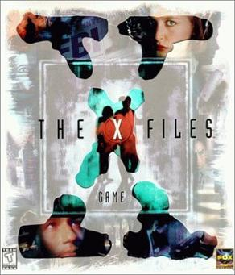
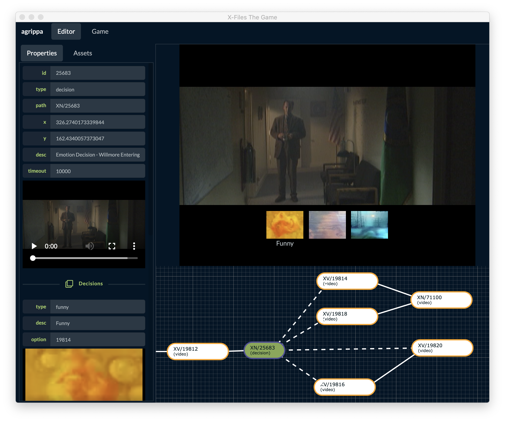

# agrippa
Agrippa - X-Files The Game Reimplementation for the Web

The aim of this project is to provide a full reimplementation for the Web of the X-Files The Game created by HyperBole Studios and Fox Interactive.

## Purpose
- Re-implementation of the X-Files The Game PC version;

- Create a new web-based authoring tool capable of replicating the game engine;

- Document the file formats and enconding scripts;

- Focus on taking advantage of the modern web development languages and frameworks like Javascript and React;

- Use as a sandbox to try new features of those frameworks during the process;

- Have fun implementing it!!

## Enhancements

* Multi-language support (subtitles)
* Adaptive streaming (bitrate streaming quality) - Video upscale to standard resolutions
* Play Full Story Sequence like a TV Show episode
* Time-based actions
* Number of full complete stories played worldwide
* Total hours worldwide played
* Player's choice statistics while playing
    * Amount of Artificial Intuition used
    * Stats per Emotion types used
    * Stats per Action types used
    * Stats per Game over
    * Number of times going Forward, Backwards, Left, Right during a gameplay

## Assets Encoding

This project dumps the original game files into modern enconding formats.
Use the dump scripts (not provided yet) to extract the contents of the game.

You will need your game original files in order to convert to new formats.

Note, the scripting files will be provided at a later stage.

## Usage

This project uses node, yarn and lerna CLI to manage multiple applications and packages in a mono repository.

Install:
* nodejs: https://nodejs.org/en/
* yarn: https://yarnpkg.com/en/

Run this commands in the root folder:

> yarn global add lerna

> lerna bootstrap

### X-Files Project Folder

This application allows you to play the game.

You will need to add into public/data folder the dumped files.

> cd projects/x-files

> yarn start
